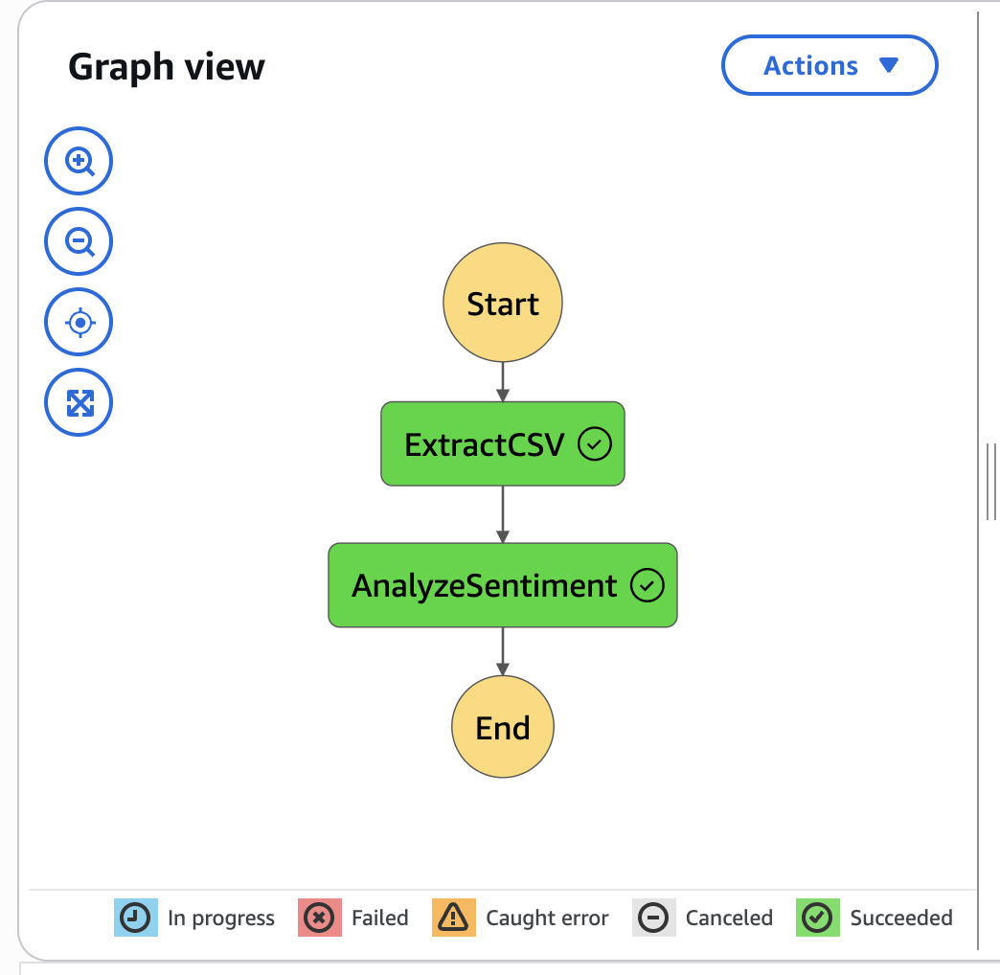
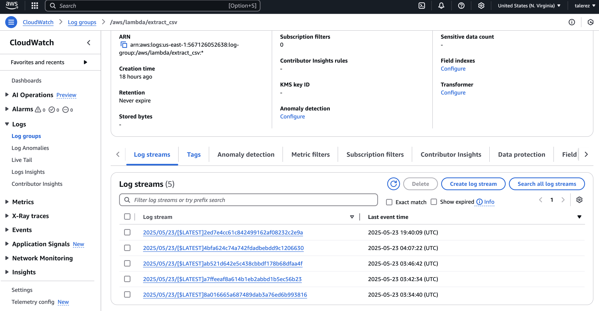
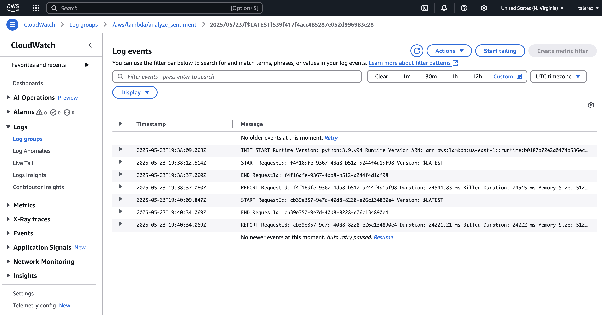
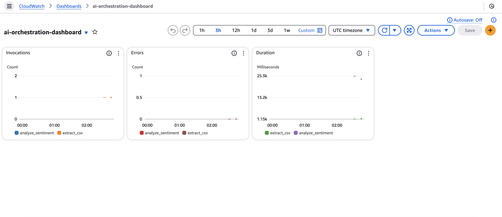

# AI Orchestration

## Notes

The original csv is too large to upload to github if you would like to download the original csv to run the upload_to_s3 file you can find it [here](https://www.kaggle.com/datasets/snap/amazon-fine-food-reviews?resource=download)

## Architecture Documentation

### Overview

This project implements an AI sentiment analysis pipeline using AWS. The architecture is serverless, event-driven and orchestrated using AWS Step Functions. It is mplemented with AWS Lambda functions for data processing and inference and uses CloudWatch as a monitoring dashboard and logging service.

### Architecture Diagram

```
         +---------------------+
         |      S3 Bucket      |
         | raw_data/reviews.csv|
         +---------+-----------+
                   |
                   v
         +---------------------+
         | Step Function Start |
         +---------+-----------+
                   |
        +----------v-----------+
        |        Lambda        |
        |     extract_csv      |
        | Filters input data   |
        +----------+-----------+
                    |
        +----------v-----------+
        |        Lambda        |
        |  analyze_sentiment   |
        | Classifies sentiment |
        +----------+-----------+
                   |
                   v
    +-------------------------------+
    |           S3 Output           |
    |  processed_data/sentiment.csv |
    +-------------------------------+
```

### AWS Services Used
- Amazon S3: To stores input and output CSVs
- AWS Lambda: Executee extract_csv and analyze_sentiment
- AWS Step Functions: Orchestrates the AI workflow
- Amazon CloudWatch: Logs and monitors Lambda performance and hosts the monitoring dashboard

### Orchestration Workflow



### Log Groups and Events





### Monitoring Dashboard



## Technical Writeup

### Objective

The goal of this project was to build a scalable, orchestrated AI pipeline using AWS. The pipeline processes user-uploaded text data and performs sentiment analysis using a TextBlob model.

### Pipeline Flow

1. A CSV file was uploaded to S3 at s3/ai-orchestration-bucket/raw_data/reviews.csv
2. The Step Function is triggered manually
3. The extract_csv Lambda:
   - Reads the raw CSV
   - Extracts only the relevant columns from the raw data. Specifically the Id and Text columns
   - It then saves the processed df to s3/ai-orchestration-bucket/processed_data/reviews.csv
4. The analyze_sentiment Lambda:
   - Reads the processed csv file into a df
   - Applies sentiment classification using TextBlob
   - Saves the text and its corresponding sentiment to s3/ai-orchestration-bucket/processed_data/sentiment.csv

### Orchestration

AWS Step Functions are used to orchestrate the flow and implement retry logic
- extract_csv runs first and stores its output
- Then analyze_sentiment runs after and consumes the processed data
- Both lambdas include retry logic max 2 retries each

### Monitoring & Logging

- Each Lambda function logs to CloudWatch at /aws/lambda/{function-name}
- A CloudWatch dashboard was created called ai-pipeline-monitor and displays for each lambda:
  - Invocations
  - Errors
  - Duration

### Error Handling & Reliability

- Step Function implement retry logic
- Errors are visible on the dashboard
- IAM roles were scoped with minimal privilege
- Functions run in isolated, stateless environments

### Tools & Technologies Used

- AWS Lambda
- AWS S3
- AWS Step Functions
- AWS CloudWatch
- Python, Pandas, TextBlob