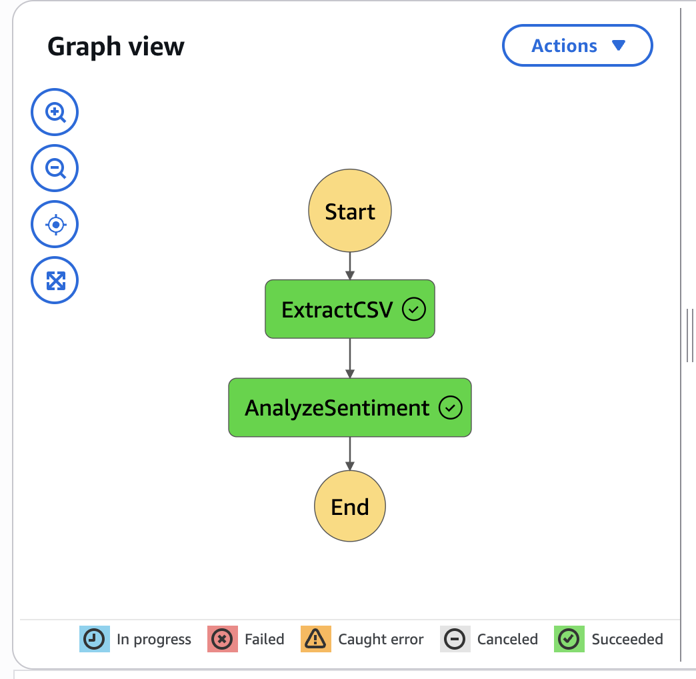
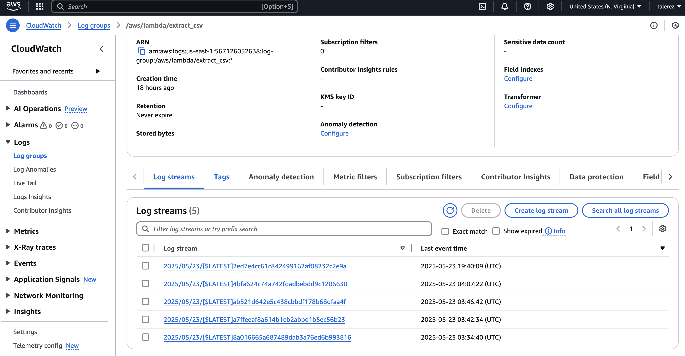

## Architecture Documentation

### Overview

This project implements an AI sentiment analysis pipeline using AWS. The architecture is serverless, event-driven and orchestrated using AWS Step Functions. It is mplemented with AWS Lambda functions for data processing and inference and uses CloudWatch as a monitoring dashboard and logging service.

### Architecture Diagram

```
         +---------------------+
         |      S3 Bucket      |
         | raw_data/reviews.csv|
         +---------+-----------+
                   |
                   v
         +---------------------+
         | Step Function Start |
         +---------+-----------+
                   |
        +----------v-----------+
        |        Lambda        |
        |     extract_csv      |
        | Filters input data   |
        +----------+-----------+
                    |
        +----------v-----------+
        |        Lambda        |
        |  analyze_sentiment   |
        | Classifies sentiment |
        +----------+-----------+
                   |
                   v
    +-------------------------------+
    |           S3 Output           |
    |  processed_data/sentiment.csv |
    +-------------------------------+
```

### AWS Services Used
- Amazon S3: To stores input and output CSVs
- AWS Lambda: Executee extract_csv and analyze_sentiment
- AWS Step Functions: Orchestrates the AI workflow
- Amazon CloudWatch: Logs and monitors Lambda performance and hosts the monitoring dashboard

### Orchestration Workflow



### Log Groups and Events




### Monitoring Dashboard

